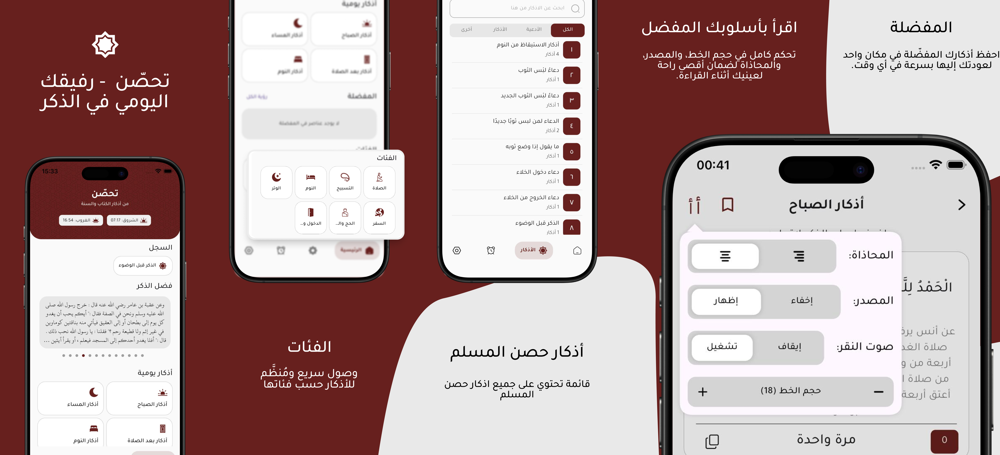
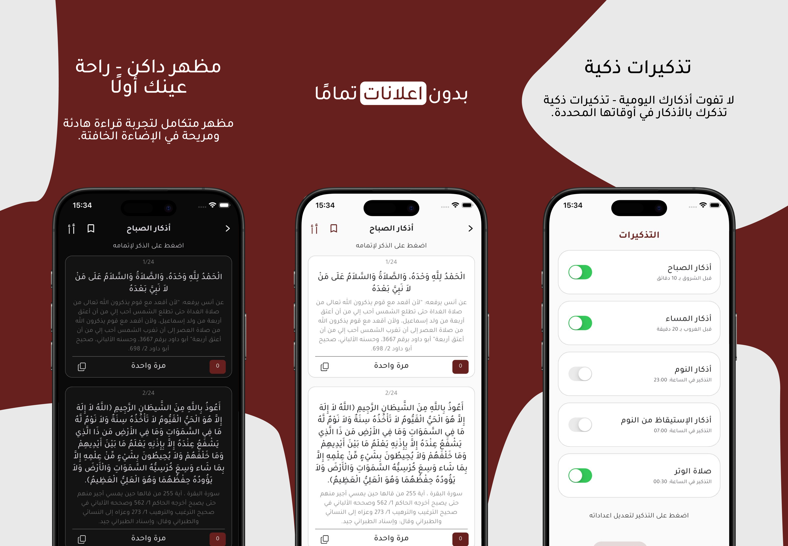

  

  # Tahassan | تحصّن
  
  **Your Daily Companion for Dhikr & Remembrance.**
   
  **رفيقُك اليوميّ في ذكر الله.. حصنٌ رقمي لقلبك.**

   

  [English](#english) | [العربية](#arabic)

   

  

    
    &nbsp;
    
  

---

## 🇬🇧 English

### 📖 About
**Tahassan** is designed to compile the Adhkar from "Hisn al-Muslim" into a complete spiritual experience. It’s not just a list of supplications; it’s a daily digital fortress that reminds you, tracks your progress, and presents Adhkar in a clear, serene design to help you focus.

The content is authentically sourced from the book **"Hisn al-Muslim"** by Sheikh Sa'id bin Ali bin Wahf Al-Qahtani.

### ⭐ Key Features

#### 🔹 Smart User Experience
* **Reading History:** The app remembers the last 4 Adhkar you read, allowing you to pick up exactly where you left off.
* **Smart Reminders:** A flexible notification system customized to your daily schedule, ensuring you never miss your Morning or Evening Adhkar.
* **Dark Mode:** A dedicated night mode to reduce eye strain during low-light reading.

#### 🔹 Organization & Content
* **Categories:** Well-organized sections (Morning/Evening, Sleep, Prayer, Travel, Witr...) for quick access.
* **Search & Favorites:** Quickly search for any Dhikr and save your most-recited ones to a dedicated Favorites list.
* **Sources & Counters:** Displays the Hadith source/reference with a built-in digital counter for repetitions.
---
# 📱 Screenshots | لقطات شاشة:

 

## 🇸🇦 العربية

### 📖 عن التطبيق
**تحصّن** هو تطبيق صُمّم ليجمع لك أذكار "حصن المسلم" في تجربة روحانية متكاملة تُعين قلبك على الثبات. التطبيق ليس مجرد قائمة أذكار، بل هو رفيق يومي يُذكّرك، ويعرض لك ما تحتاجه من ذكر بصياغة واضحة وتصميم هادئ يساعدك على الخشوع.

يعتمد التطبيق في محتواه على كتاب **حصن المسلم** للشيخ سعيد بن علي بن وهف القحطاني، لضمان صحة الأذكار وسلامة مصادرها.
### ⭐ المميزات الرئيسية

#### 🔹 تجربة مستخدم ذكية
* **سجل القراءة (Last Read):** يعرض لك آخر 4 أذكار قرأتها لتكمل وردك من حيث توقفت دون عناء البحث.
* **التذكيرات الذكية:** نظام تنبيهات مرن يمكنك ضبطه ليناسب يومك، لضمان عدم تفويت أذكار الصباح والمساء.
* **الوضع الليلي (Dark Mode):** تصميم مريح للعين مخصص للقراءة في الإضاءة الخافتة.

#### 🔹 تنظيم ومحتوى شامل
* **الفئات:** تنظيم دقيق للأذكار (الصباح والمساء، النوم، الصلاة، السفر، الوتر...) للوصول السريع.
* **البحث والمفضلة:** إمكانية البحث السريع عن أي ذكر، وحفظ الأذكار المحببة إليك.
* **المصادر والعداد:** عرض تخريج الحديث ومصدره، مع عداد إلكتروني لتتبع عدد مرات التكرار.
### 📬 تواصل معنا | Contact
If you have any suggestions or feedback:
إذا كان لديك أي اقتراح أو استفسار:

📧 `TahassanApp@gmail.com`
---

  Developed with ❤️ for the Ummah

